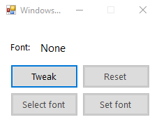
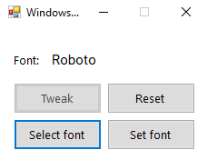

# WindowsFontEditor
Simple software to change windows 10 default interface font.
In case of any issue use the "reset" function.

Works by editing the registry keys on:

```
HKEY_LOCAL_MACHINE\SOFTWARE\Microsoft\Windows NT\CurrentVersion\FontSubstitutes
HKEY_LOCAL_MACHINE\SOFTWARE\Microsoft\Windows NT\CurrentVersion\Fonts
```

UI Pictures




